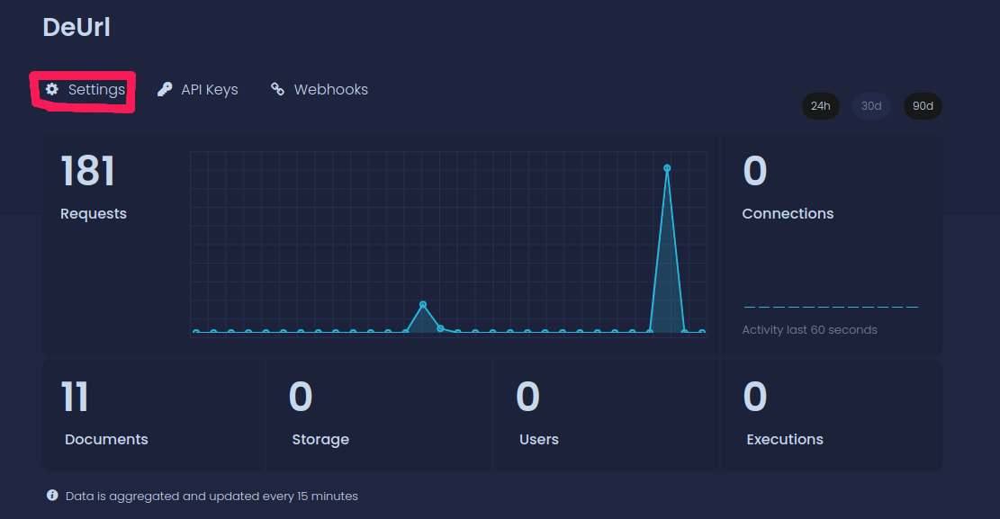
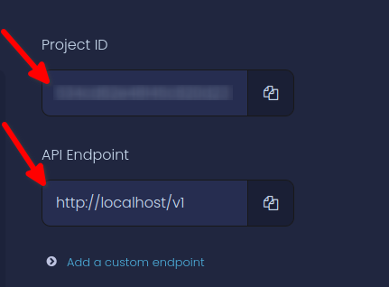
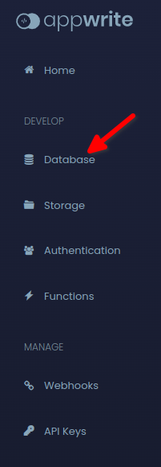
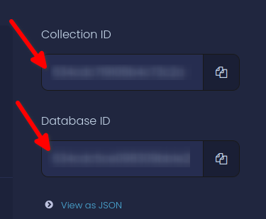

<font face="Raleway">
<center>

# DEURL &#40;Appwrite + NuxtJs&#41;
</center>

## Introduction 😶‍🌫
<ul type="none">
 <li><font color="#6495ed">&cirmid;&nbsp;&nbsp;</font>DEURL is a Demo URL Shortner website made with Appwrite + NuxtJs + ❤️</li>
 <li><font color="#6495ed">&cirmid;&nbsp;&nbsp;</font>The site is intended to create a new short URL for external URLs</li>
 <li>
   <font color="#6495ed">&cirmid;&nbsp;&nbsp;</font>Note that this is just a <b> Demo product</b> and <b>cannot be used as a commercial product.</b>
 </li>
</ul>
<hr>

## Setup 🧰
<div>

### &nbsp;&nbsp;Step 1: Clone project repository
<p>
    To get started first clone the project:
</p>

```bash
git clone https://github.com/AVDiv/appwrite_nuxtjs_url_shortner.git
```
<p>
    Next change directory to the project folder:
</p>

```bash
cd appwrite_nuxtjs_url_shortner
```
If your have any interest in this project, please give it a star ⭐️ and fork it 🍴.<br>
Add your changes and make pull requests to contribute to this project.
</div>
<div>

### &nbsp;&nbsp;Step 2: Install packages for the project
<p>
    Before installing the packages please make sure that you are using a NodeJs version above 18.0.0.
</p>
<p>
    To install the packages for the project, run the following command:
</p>

```bash
npm install
```
</div>
<div>

### &nbsp;&nbsp;Step 3: Initialize appwrite project
<p>
    First install <a href="https://appwrite.io/docs/installation">appwrite</a>, if you haven't already!
</p>
<p>
    Next install appwrite cli:
</p>

```bash
npm install -g appwrite-cli
```
<p>
    After these installations we can proceed to initialize the appwrite project.<br>
    Login/Signin to the local appwrite server and create a new project in the name 'DeUrl'.
    In the project create a database named 'deurl' and a collection named 'url_tokens'.<br>
    Create 2 attributes with the following parameters:
</p>
    
    ┌──────────────┬────────┬──────────┬─────────────┼
    | Attribute ID |  Type  | Required │    Length   │
    ├──────────────┼────────┼──────────┼─────────────┤
    |     url      | string	|   True   │             │
    |    token     | string	|   True   │             │
    ┼──────────────┴────────┴──────────┴─────────────┘
<br>
<p>
  So, the appwrite project should be in this structure:
</p>

    DeUrl(Project) ┐
                   │
                   │
              deurl(Database) ┐
                              │
                              │
                    url_tokens(Collection) ┐
                                           ├ $id (Auto-generated Attribute)
                                           │
                                           ├ url (Attribute)
                                           │
                                           └ token (Attribute)

</div>
<div>

### &nbsp;&nbsp;Step 4: Add appwrite configurations
<p>
    Now we need to add the appwrite configurations to the nuxt app, So it can communicate with the appwrite API to get data from the server.<br>
    For this we need 4 things from the appwrite server:<br>
<ol>
<li>The Appwrite server's endpoint (Usually "http://localhost/v1/" for local servers).</li>
<li>The Appwrite Project ID</li>
<li>The Appwrite Database ID</li>
<li>The Appwrite Collection ID</li>
</ol>
</p>
<p>
    First to find out the Appwrite endpoint and the project ID go to your appwrite dashboard and select the relevant project. From there you will see a <code> ⚙️ Settings</code> tab;
</p>

<p>
    Click on the <code> ⚙️ Settings</code> tab and you will see the endpoint and the project ID on the right side, Copy the values of these values;
</p>

<p>
    Next, click the <code> 🗄 Databases</code> tab on the left side;
</p>

<p>
    Click on the Collection we created previously and click on the <code> ⚙️ Settings</code> tab and you will see the database ID and the collection ID on the right side, Copy the values of these values;
</p>

<p>
    Now as we have copied all the values we need to paste it in the <code> /model/appwrite/appwriteConfig.js</code> file in the root directory of the project.
</p>
</div> 
<div>

### &nbsp;&nbsp;Step 5: All set!!! 🥳🎉
<p>
    That's it🥳,
    Now you can run the project with the following command:

```bash
npm run dev
```
</p>
 This will start the nuxt app on the port 4000. If you want the project to run on another port you could change it on the nuxt configuration file(<code> nuxt.config.js</code>).<br>
 In case you are going through other errors while starting the project, Please check the <a href="#errors">errors section</a> on this file.

</p>
</div>
<hr>

## Got errors? 🤯😭
<p id="errors">
    This is the worst part of every project.🤪<br><br>
    Here are some fixes for issues that we ran into, In case you run into issues other than the listed, Please feel free to list it as an the Issue.
</p>
<div>

### code:ELIFECYCLE
<p>
    If your getting an error like this,
</p>

```bash
...
FATAL  Unexpected token '.'

at Loader.moduleStrategy (internal/modules/esm/translators.js:140:18)
at async link (internal/modules/esm/module_job.js:42:21)


╭───────────────────────────────────────╮
│                                       │
│   ✖ Nuxt Fatal Error                  │
│                                       │
│   SyntaxError: Unexpected token '.'   │
│                                       │
╰───────────────────────────────────────╯

npm ERR! code ELIFECYCLE
npm ERR! errno 1
npm ERR! @ dev: `nuxt`
npm ERR! Exit status 1
npm ERR!
npm ERR! Failed at the @ dev script.
npm ERR! This is probably not a problem with npm. There is likely additional logging output above.
...
```
<p>
    This is because of the version of node you are using. Please use node version 18.0.0 or above.
</p>
</div>
<div>

### Error:0308010C

```bash
node:internal/crypto/hash:67
  this[kHandle] = new _Hash(algorithm, xofLen);
                  ^

Error: error:0308010C:digital envelope routines::unsupported
    at new Hash (node:internal/crypto/hash:67:19)
    at Object.createHash (node:crypto:130:10)
...
```

This error could be fixed by the following command

```bash
export NODE_OPTIONS=--openssl-legacy-provider
```
</div>
<div>

### Self signed certificate error


```bash
request to https://localhost/v1/databases/... failed, reason: self signed certificate

  at ClientRequest.<anonymous> (node_modules/appwrite/dist/cjs/sdk.js:400:23)
  at Generator.throw (<anonymous>)
  at rejected (node_modules/appwrite/dist/cjs/sdk.js:25:65)
  at process.processTicksAndRejections (node:internal/process/task_queues:96:5)
```
This error is thrown by node when it encounters a self-signed certificate(which means its unsecure) from a request done to an external URL. <br>
In this project, An API calls are made to the backend of the nuxt app for various functions of the app and the nuxt app does API calls to the appwrite server to do transactions with the database. <br>
So, in the second layer of API calls, as the nuxt backend makes the request from the appwrite server, the appwrite server responds with a self-signed certificate. <br>
So, the ideal to resolve this error is to get an SSL certificate. But, As this project is not a app hosted or used as a end-product. We could disable the SSL verfication option in node. <br>
Enter this command in your terminal:
```bash
  export NODE_TLS_REJECT_UNAUTHORIZED=0
```  
Note: This is never recommended for production use. Also, remember to ON SSL verification after you are done with looking the project.
```bash
export NODE_TLS_REJECT_UNAUTHORIZED=1
```

</div>
</font>
